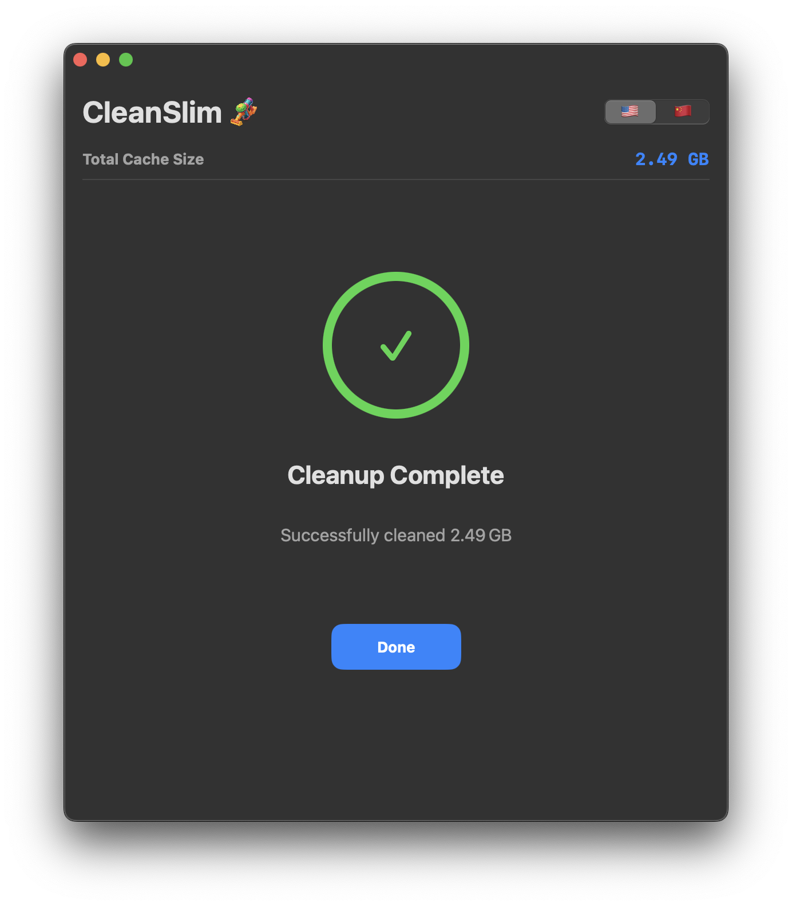

# CleanSlim   

Cache & Temp Cleaner for macOS

A personal learning project to try out Swift Package Manager (SPM), intentionally over-modularized for learning purposes.

这是一个「架构行为艺术」项目，场景过度设计，仅为个人学习试验Swift Package Manager。注意本工具不是演示，会真实清理指定目录，数据不可恢复。

## Safety Notice

This tool is not a demo — it will clean the specified directories and permanently delete data：

- `~/Library/Caches`
- `DerivedData`
- And other selected directories

## Screenshots

<div style="display: flex; flex-wrap: nowrap; gap: 10px; width: 100%;">
  
  
</div>

## Build

```bash
swift package clean
swift build
.build/debug/CleanSlim
